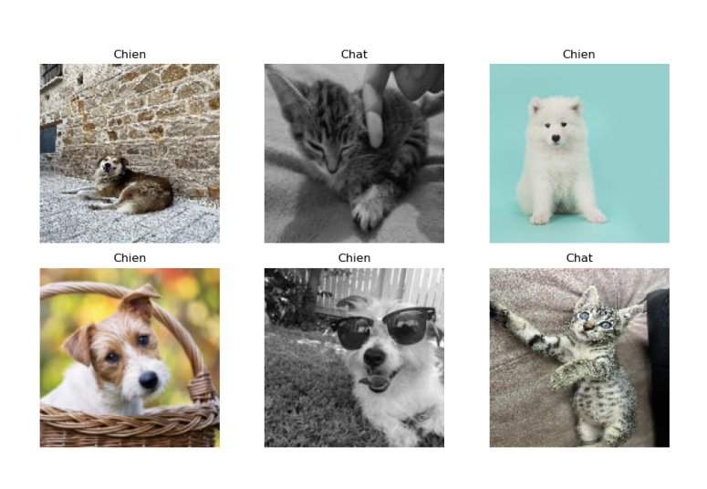

# Deep-Learning-Delight-Crafting-a-Robust-CNN-for-Cats-and-Dogs-Image-Classification

Cats and Dogs Image Classification with Convolutional Neural Network (CNN)
Project Overview:
In this project, I've developed a powerful Convolutional Neural Network (CNN) using TensorFlow and Keras to classify images of cats and dogs. With a dataset of over 30,000 images per category sourced from Kaggle, the model underwent rigorous training, validation, and augmentation techniques to achieve outstanding accuracy and robust generalization.

Key Highlights:

Built a deep CNN architecture to distinguish between cats and dogs in images.
Leveraged an extensive dataset of more than 60,000 images for comprehensive training.
Employed advanced data augmentation strategies to enhance model performance and prevent overfitting.
Explored and visualized the training and validation loss and accuracy curves for model assessment.
Results:

Achieved a remarkable accuracy of [Your Accuracy Value] on the validation set.
Successfully created a model capable of distinguishing between cats and dogs with impressive precision.
Technologies Used:

TensorFlow
Keras
Python
How to Use:

Clone this repository to your local machine.
Navigate to the project directory and ensure you have the necessary dependencies installed.
Run the provided Jupyter Notebook to train and evaluate the model.
Explore the model's architecture, training history, and predictions.
This project showcases the power of deep learning and computer vision, highlighting the potential of neural networks in interpreting and classifying visual data. Feel free to contribute or use the model for your own image classification tasks!
